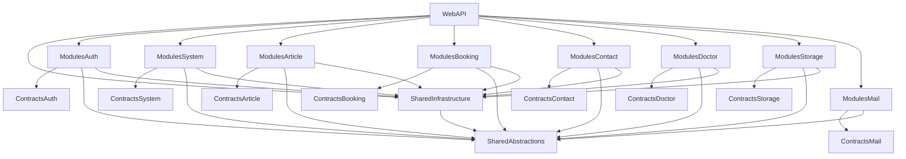

# Backend Template Architecture for AI Scaffolding

## Mục tiêu tài liệu

Tài liệu này mô tả **khung kiến trúc backend** của dự án hiện tại để một AI coding agent có thể tạo ra một backend mới với cấu trúc tương tự mà **không cần sao chép business logic**.

Trọng tâm của tài liệu là:

- layout của solution và project
- hướng phụ thuộc giữa các project
- composition root và cách bootstrapping ứng dụng
- pattern tổ chức module
- shared abstractions và shared infrastructure
- cách tổ chức database access, auth, middleware, config, SQL scripts
- các convention cần giữ nguyên khi scaffold một backend mới

Tài liệu này **không mô tả nghiệp vụ chi tiết** của từng module hiện tại.

---

## 1. Kiến trúc tổng thể

Backend hiện tại đi theo hướng **modular monolith** trên .NET:

- chỉ có **một Web API host** chạy toàn bộ hệ thống
- code được tách thành nhiều project theo vai trò
- mỗi domain/module nằm trong một `Modules.*` project riêng
- public contracts của từng module nằm trong `Contracts.*`
- hạ tầng dùng chung nằm ở `Shared.*`
- `WebAPI` là composition root để ghép mọi thành phần lại với nhau

Sơ đồ phụ thuộc ở mức cao:



Nguồn tham chiếu solution hiện tại:

```1:30:HospitalTTG/HospitalTTG.slnx
<Solution>
  <Folder Name="/Contracts/">
    <Project Path="Contracts.Article/Contracts.Article.csproj" />
    <Project Path="Contracts.Auth/Contracts.Auth.csproj" />
    <Project Path="Contracts.Doctor/Contracts.Doctor.csproj" />
    <Project Path="Contracts.Mail/Contracts.Mail.csproj" />
    <Project Path="Contracts.Search/Contracts.Search.csproj" />
    <Project Path="Contracts.Storage/Contracts.Storage.csproj" />
    <Project Path="Contracts.System/Contracts.System.csproj" />
    <Project Path="Contracts.Contact/Contracts.Contact.csproj" />
    <Project Path="Contracts.Booking/Contracts.Booking.csproj" />
  </Folder>
  <Folder Name="/Host/">
    <Project Path="WebAPI/WebAPI.csproj" />
  </Folder>
  <Folder Name="/Modules/">
    <Project Path="Modules.Article/Modules.Article.csproj" />
    // ... more code ...
```

---

## 2. Cấu trúc solution nên giữ khi tạo dự án mới

### 2.1. Nhóm project

Một backend mới tương tự nên chia thành 4 nhóm project:

1. `WebAPI`
   - project ASP.NET Core host
   - chứa `Program.cs`
   - chứa controllers
   - tham chiếu tới các module và shared infrastructure

2. `Shared.Abstractions`
   - các base entity
   - repository abstraction
   - unit of work abstraction
   - exception base classes
   - response wrappers
   - các type dùng chung không phụ thuộc hạ tầng

3. `Shared.Infrastructure`
   - `AppDbContext`
   - Db registration
   - generic repository base nếu cần
   - middleware dùng chung
   - các thành phần infrastructure dùng toàn hệ thống

4. `Contracts.*` và `Modules.*`
   - mỗi domain tách thành 2 project:
     - `Contracts.ModuleX`
     - `Modules.ModuleX`

### 2.2. Gợi ý cây thư mục

```text
BackendTemplate/
├─ BackendTemplate.slnx
├─ Directory.Build.props
├─ Directory.Packages.props
├─ WebAPI/
│  ├─ Program.cs
│  ├─ WebAPI.csproj
│  ├─ Controllers/
│  ├─ Properties/
│  ├─ appsettings.json
│  └─ appsettings.Development.json
├─ Shared.Abstractions/
│  ├─ Entities/
│  ├─ Interfaces/
│  ├─ Exceptions/
│  ├─ Responses/
│  └─ Shared.Abstractions.csproj
├─ Shared.Infrastructure/
│  ├─ Data/
│  ├─ Middleware/
│  ├─ Extensions.cs
│  └─ Shared.Infrastructure.csproj
├─ Contracts.ModuleA/
│  ├─ DTOs/
│  ├─ Interfaces/
│  ├─ Enums/
│  └─ Contracts.ModuleA.csproj
├─ Modules.ModuleA/
│  ├─ Entities/
│  ├─ Configurations/
│  ├─ Repositories/
│  ├─ Services/
│  ├─ Extensions.cs
│  └─ Modules.ModuleA.csproj
├─ Contracts.ModuleB/
├─ Modules.ModuleB/
└─ migrations/
```

---

## 3. Dependency rules phải giữ chặt

Đây là phần quan trọng nhất nếu muốn AI agent scaffold đúng kiến trúc.

### 3.1. Luật phụ thuộc

- `WebAPI` được phép tham chiếu tới:
  - `Shared.Infrastructure`
  - các `Modules.*`
  - một số `Contracts.*` khi thật sự cần

- `Shared.Abstractions`
  - không tham chiếu project nội bộ khác
  - phải giữ càng thuần càng tốt

- `Shared.Infrastructure`
  - chỉ nên tham chiếu `Shared.Abstractions`
  - chứa EF Core, middleware, DbContext, infra registration

- `Contracts.ModuleX`
  - chỉ chứa DTOs, interfaces, enums, request/response models
  - không chứa business logic
  - có thể tham chiếu `Shared.Abstractions` nếu cần shared response/abstraction

- `Modules.ModuleX`
  - tham chiếu `Contracts.ModuleX`
  - tham chiếu `Shared.Abstractions`
  - tham chiếu `Shared.Infrastructure`
  - nếu thật sự cần nói chuyện với module khác thì **chỉ tham chiếu sang `Contracts.ModuleY`**, không tham chiếu trực tiếp `Modules.ModuleY`

### 3.2. Điều tuyệt đối tránh

- không để `Modules.A` tham chiếu trực tiếp `Modules.B`
- không để `Shared.Abstractions` kéo theo EF Core hoặc ASP.NET Core trừ khi có ngoại lệ rất rõ
- không nhét controller vào module nếu muốn bám sát cấu trúc hiện tại
- không để mỗi module có DbContext riêng nếu mục tiêu là clone đúng kiểu backend hiện tại

Tham chiếu thực tế của host hiện tại:

```59:70:HospitalTTG/WebAPI/WebAPI.csproj
  <ItemGroup>
    <ProjectReference Include="..\Shared.Infrastructure\Shared.Infrastructure.csproj" />
    <ProjectReference Include="..\Modules.Auth\Modules.Auth.csproj" />
    <ProjectReference Include="..\Modules.System\Modules.System.csproj" />
    <ProjectReference Include="..\Modules.Article\Modules.Article.csproj" />
    <ProjectReference Include="..\Modules.Contact\Modules.Contact.csproj" />
    <ProjectReference Include="..\Modules.Booking\Modules.Booking.csproj" />
    <ProjectReference Include="..\Modules.Storage\Modules.Storage.csproj" />
    <ProjectReference Include="..\Modules.Doctor\Modules.Doctor.csproj" />
    <ProjectReference Include="..\Modules.Mail\Modules.Mail.csproj" />
    <ProjectReference Include="..\Contracts.Search\Contracts.Search.csproj" />
  </ItemGroup>
```

Ví dụ module hiện tại phụ thuộc theo đúng hướng:

```9:13:HospitalTTG/Modules.Auth/Modules.Auth.csproj
  <ItemGroup>
    <ProjectReference Include="..\Contracts.Auth\Contracts.Auth.csproj" />
    <ProjectReference Include="..\Shared.Abstractions\Shared.Abstractions.csproj" />
    <ProjectReference Include="..\Shared.Infrastructure\Shared.Infrastructure.csproj" />
  </ItemGroup>
```

---

## 4. Global build setup

Một template mới nên có 2 file gốc giống pattern hiện tại:

### 4.1. `Directory.Build.props`

Dùng để áp dụng rule build chung cho tất cả project:

```1:7:HospitalTTG/Directory.Build.props
<Project>
  <PropertyGroup>
    <TargetFramework>net10.0</TargetFramework>
    <Nullable>enable</Nullable>
    <ImplicitUsings>enable</ImplicitUsings>
  </PropertyGroup>
</Project>
```

### 4.2. `Directory.Packages.props`

Dùng package version tập trung, tránh lặp version ở từng `.csproj`:

```1:21:HospitalTTG/Directory.Packages.props
<Project>
  <PropertyGroup>
    <ManagePackageVersionsCentrally>true</ManagePackageVersionsCentrally>
  </PropertyGroup>
  <ItemGroup>
    <!-- EF Core -->
    <PackageVersion Include="Microsoft.EntityFrameworkCore" Version="10.0.0" />
    <PackageVersion Include="Microsoft.EntityFrameworkCore.SqlServer" Version="10.0.0" />
    <PackageVersion Include="Microsoft.EntityFrameworkCore.Design" Version="10.0.0" />
    <!-- Auth -->
    <PackageVersion Include="Microsoft.AspNetCore.Authentication.JwtBearer" Version="10.0.0" />
    // ... more code ...
```

Khi scaffold dự án mới, AI agent nên ưu tiên giữ pattern này.

---

## 5. Composition root và startup flow

Toàn bộ ứng dụng được ghép tại `WebAPI/Program.cs`.

Luồng khởi tạo hiện tại:

1. add controllers
2. add OpenAPI/Swagger
3. add CORS policy từ config
4. add shared infrastructure
5. add từng module qua `Add{Module}Module(...)`
6. build app
7. đăng ký middleware pipeline
8. map controllers

Code hiện tại:

```12:59:HospitalTTG/WebAPI/Program.cs
var builder = WebApplication.CreateBuilder(args);

builder.Services.AddControllers();
builder.Services.AddEndpointsApiExplorer();
builder.Services.AddSwaggerGen();

builder.Services.AddCors(options =>
{
    options.AddPolicy("Frontend", policy =>
    {
        var origins = builder.Configuration.GetSection("Cors:AllowedOrigins").Get<string[]>() ?? [];
        policy.WithOrigins(origins)
              .AllowAnyHeader()
              .AllowAnyMethod();
    });
});

builder.Services.AddSharedInfrastructure(builder.Configuration);

builder.Services.AddAuthModule(builder.Configuration);
builder.Services.AddSystemModule(builder.Configuration);
builder.Services.AddArticleModule(builder.Configuration);
builder.Services.AddContactModule(builder.Configuration);
builder.Services.AddBookingModule(builder.Configuration);
builder.Services.AddStorageModule(builder.Configuration);
builder.Services.AddDoctorModule(builder.Configuration);
builder.Services.AddMailModule(builder.Configuration);

var app = builder.Build();

if (app.Environment.IsDevelopment())
{
    app.UseSwagger();
    app.UseSwaggerUI();
}

app.UseMiddleware<ExceptionHandlingMiddleware>();
app.UseCors("Frontend");
app.UseHttpsRedirection();

app.UseAuthentication();
app.UseAuthorization();

app.MapControllers();

app.Run();
```

### Convention cần giữ

- mọi module expose đúng **một entry point DI** thông qua `Extensions.cs`
- `Program.cs` chỉ đóng vai trò ghép module, không chứa business logic
- middleware dùng chung đặt trước auth/authorization nếu cần bắt exception toàn cục

---

## 6. Pattern chuẩn cho từng module

Mỗi module mới nên có cấu trúc sau:

```text
Modules.ModuleX/
├─ Entities/
├─ Configurations/
├─ Repositories/
├─ Services/
├─ Extensions.cs
└─ Modules.ModuleX.csproj
```

Project `Contracts.ModuleX` tương ứng:

```text
Contracts.ModuleX/
├─ DTOs/
├─ Interfaces/
├─ Enums/
└─ Contracts.ModuleX.csproj
```

### 6.1. Ý nghĩa từng phần

- `Entities/`
  - EF entity classes
  - thường kế thừa `BaseEntity` hoặc `AuditableEntity`

- `Configurations/`
  - các class `IEntityTypeConfiguration<T>`
  - tách cấu hình bảng/cột/index khỏi entity

- `Repositories/`
  - truy cập dữ liệu
  - hiện thực interface repository nếu cần

- `Services/`
  - orchestration / application logic
  - hiện thực interface từ `Contracts.ModuleX.Interfaces`

- `Extensions.cs`
  - điểm đăng ký DI của module
  - nơi module khai báo repo/service/configuration assembly

Ví dụ module article:

```11:28:HospitalTTG/Modules.Article/Extensions.cs
public static class Extensions
{
    public static IServiceCollection AddArticleModule(this IServiceCollection services, IConfiguration configuration)
    {
        AppDbContext.RegisterModuleAssembly(typeof(CategoryConfiguration).Assembly);

        // Repositories
        services.AddScoped<ICategoryRepository, CategoryRepository>();
        services.AddScoped<IContentRepository, ContentRepository>();
        services.AddScoped<IContentMediaRepository, ContentMediaRepository>();

        // Services
        services.AddScoped<ICategoryService, CategoryService>();
        services.AddScoped<IContentService, ContentService>();
        services.AddScoped<IContentMediaService, ContentMediaService>();

        return services;
    }
}
```

### Convention cần giữ

- mỗi module có đúng 1 `Extensions.cs`
- trong đó phải:
  - đăng ký assembly EF configuration
  - đăng ký repositories
  - đăng ký services
- interface public nên nằm ở `Contracts.*`, không nằm trong `WebAPI`

---

## 7. Một DbContext trung tâm cho toàn bộ modules

Backend hiện tại không dùng DbContext riêng cho từng module. Thay vào đó dùng **một `AppDbContext` chung** trong `Shared.Infrastructure`.

Điểm đặc trưng là mỗi module tự đăng ký assembly của mình để `AppDbContext` apply các EF configuration tương ứng.

Code hiện tại:

```10:67:HospitalTTG/Shared.Infrastructure/Data/AppDbContext.cs
public class AppDbContext : DbContext, IUnitOfWork
{
    private static readonly List<Assembly> _moduleAssemblies = [];

    public static void RegisterModuleAssembly(Assembly assembly)
    {
        if (!_moduleAssemblies.Contains(assembly))
            _moduleAssemblies.Add(assembly);
    }

    protected override void OnModelCreating(ModelBuilder modelBuilder)
    {
        base.OnModelCreating(modelBuilder);

        foreach (var assembly in _moduleAssemblies)
        {
            modelBuilder.ApplyConfigurationsFromAssembly(assembly);
        }
    }
}
```

### Lợi ích của pattern này

- mỗi module tự quản entity configuration của mình
- không cần central registry dài trong `AppDbContext`
- dễ thêm module mới mà không phải sửa quá nhiều nơi
- giữ modularity khá tốt dù vẫn là monolith

### Khi scaffold dự án mới

AI agent nên:
- tạo `AppDbContext` ở `Shared.Infrastructure`
- tạo `RegisterModuleAssembly(...)`
- trong mỗi `Modules.ModuleX.Extensions.cs`, gọi `AppDbContext.RegisterModuleAssembly(typeof(SomeConfiguration).Assembly)`

---

## 8. Shared abstractions nên có gì

`Shared.Abstractions` là project nền tảng, càng ít phụ thuộc càng tốt.

Các phần hiện tại đáng giữ cho template mới:

### 8.1. Base entities

```3:8:HospitalTTG/Shared.Abstractions/Entities/BaseEntity.cs
public abstract class BaseEntity
{
    public Guid Id { get; set; }
    public DateTime CreatedAt { get; set; }
    public DateTime? UpdatedAt { get; set; }
}
```

```3:7:HospitalTTG/Shared.Abstractions/Entities/AuditableEntity.cs
public abstract class AuditableEntity : BaseEntity
{
    public string? CreatedBy { get; set; }
    public string? UpdatedBy { get; set; }
}
```

### 8.2. Repository / unit of work abstractions

```3:6:HospitalTTG/Shared.Abstractions/Interfaces/IUnitOfWork.cs
public interface IUnitOfWork
{
    Task<int> SaveChangesAsync(CancellationToken ct = default);
}
```

```6:14:HospitalTTG/Shared.Abstractions/Interfaces/IRepository.cs
public interface IRepository<T> where T : BaseEntity
{
    Task<T?> GetByIdAsync(Guid id, CancellationToken ct = default);
    Task<IReadOnlyList<T>> GetAllAsync(CancellationToken ct = default);
    Task<IReadOnlyList<T>> FindAsync(Expression<Func<T, bool>> predicate, CancellationToken ct = default);
    Task<T> AddAsync(T entity, CancellationToken ct = default);
    void Update(T entity);
    void Delete(T entity);
}
```

### 8.3. Response wrappers

```3:25:HospitalTTG/Shared.Abstractions/Responses/ApiResponse.cs
public class ApiResponse<T>
{
    public T? Data { get; set; }
    public bool Succeeded { get; set; }
    public string? Message { get; set; }

    public ApiResponse(T data, string? message = null)
    {
        Succeeded = true;
        Message = message;
        Data = data;
    }
}
```

```3:18:HospitalTTG/Shared.Abstractions/Responses/PagedResponse.cs
public class PagedResponse<T> : ApiResponse<T>
{
    public int PageNumber { get; set; }
    public int PageSize { get; set; }
    public int TotalPages { get; set; }
    public int TotalRecords { get; set; }
}
```

### 8.4. Exceptions

```3:12:HospitalTTG/Shared.Abstractions/Exceptions/BaseException.cs
public abstract class BaseException : Exception
{
    public int StatusCode { get; }

    protected BaseException(string message, int statusCode = 500)
        : base(message)
    {
        StatusCode = statusCode;
    }
}
```

### Gợi ý cho dự án mới

Tối thiểu nên có:
- `Entities/BaseEntity.cs`
- `Entities/AuditableEntity.cs`
- `Interfaces/IRepository.cs`
- `Interfaces/IUnitOfWork.cs`
- `Exceptions/BaseException.cs`
- `Responses/ApiResponse.cs`
- `Responses/PagedResponse.cs`

---

## 9. Shared infrastructure nên có gì

`Shared.Infrastructure` nên là nơi chứa toàn bộ phần infra dùng chung.

Tối thiểu nên có:

```text
Shared.Infrastructure/
├─ Data/
│  ├─ AppDbContext.cs
│  └─ BaseRepository.cs
├─ Middleware/
│  └─ ExceptionHandlingMiddleware.cs
├─ Extensions.cs
└─ Shared.Infrastructure.csproj
```

### 9.1. Đăng ký DbContext và UnitOfWork

```11:20:HospitalTTG/Shared.Infrastructure/Extensions.cs
public static class Extensions
{
    public static IServiceCollection AddSharedInfrastructure(this IServiceCollection services, IConfiguration configuration)
    {
        services.AddDbContext<AppDbContext>(options =>
            options.UseSqlServer(configuration.GetConnectionString("DefaultConnection")));

        services.AddScoped<IUnitOfWork>(sp => sp.GetRequiredService<AppDbContext>());
        services.AddHttpContextAccessor();

        return services;
    }
}
```

### 9.2. Global exception middleware

```21:63:HospitalTTG/Shared.Infrastructure/Middleware/ExceptionHandlingMiddleware.cs
public async Task InvokeAsync(HttpContext context)
{
    try
    {
        await _next(context);
    }
    catch (BaseException ex)
    {
        context.Response.StatusCode = ex.StatusCode;
        context.Response.ContentType = "application/problem+json";
        // ... more code ...
    }
    catch (Exception ex)
    {
        context.Response.StatusCode = StatusCodes.Status500InternalServerError;
        context.Response.ContentType = "application/problem+json";
        // ... more code ...
    }
}
```

### 9.3. Audit timestamps và audit user

`AppDbContext.SaveChangesAsync()` đang tự set:
- `CreatedAt`
- `UpdatedAt`
- `CreatedBy`
- `UpdatedBy`

nếu entity kế thừa đúng base class tương ứng.

Khi scaffold mới, đây là pattern tốt nên giữ.

---

## 10. Controllers đặt ở WebAPI thay vì trong module

Một đặc điểm rất rõ của backend này là controllers nằm trong `WebAPI/Controllers`, không nằm trong `Modules.*`.

Ví dụ các controller hiện có đều đặt ở host project như:
- `WebAPI/Controllers/AuthController.cs`
- `WebAPI/Controllers/UsersController.cs`
- `WebAPI/Controllers/CategoriesController.cs`
- `WebAPI/Controllers/BookingsController.cs`

Ví dụ controller dùng interface contract thay vì bám trực tiếp implementation:

```12:30:HospitalTTG/WebAPI/Controllers/AuthController.cs
[ApiController]
[Route("api/[controller]")]
public class AuthController : ControllerBase
{
    private readonly IAuthService _authService;

    public AuthController(IAuthService authService)
    {
        _authService = authService;
    }

    [HttpPost("login")]
    public async Task<ActionResult<ApiResponse<TokenResponse>>> Login(LoginRequest request, CancellationToken ct)
    {
        var result = await _authService.LoginAsync(request, ct);
        return Ok(new ApiResponse<TokenResponse>(result, "Login successful"));
    }
}
```

### Khi scaffold dự án mới

Nên giữ pattern:
- controller ở `WebAPI`
- inject interface từ `Contracts.*`
- implementation nằm trong `Modules.*`

Pattern này giúp:
- host project là API boundary rõ ràng
- module không phụ thuộc ASP.NET controller concerns
- test service/module dễ hơn

---

## 11. Config tối thiểu trong appsettings

Backend hiện tại dùng `appsettings.json` cho các nhóm config chính:

- `ConnectionStrings`
- `Cors`
- `Storage`
- `Mail`
- `Jwt`

Với một backend template mới, nên có tối thiểu:

```json
{
  "ConnectionStrings": {
    "DefaultConnection": "<sqlserver-connection-string>"
  },
  "Cors": {
    "AllowedOrigins": []
  },
  "Jwt": {
    "Key": "<jwt-key>",
    "Issuer": "<issuer>",
    "Audience": "<audience>",
    "ExpiryMinutes": 60,
    "RefreshTokenExpiryDays": 7
  }
}
```

Nếu dự án có upload file hoặc email thì thêm:
- `Storage`
- `Mail`

Lưu ý: khi viết tài liệu scaffold cho AI agent, nên yêu cầu agent dùng environment variables hoặc secret store cho môi trường thực tế.

---

## 12. Auth và authorization nên scaffold như thế nào

Nếu muốn clone gần sát backend hiện tại, AI agent nên scaffold:

- JWT Bearer auth
- password hashing bằng BCrypt
- refresh token support
- policy-based authorization
- có thể thêm permission-based authorization layer

Cách auth module hiện tại đăng ký DI và auth:

```21:58:HospitalTTG/Modules.Auth/Extensions.cs
public static IServiceCollection AddAuthModule(this IServiceCollection services, IConfiguration configuration)
{
    AppDbContext.RegisterModuleAssembly(typeof(UserConfiguration).Assembly);
    AppDbContext.RegisterModuleAssembly(typeof(RoleConfiguration).Assembly);

    services.AddScoped<IUserRepository, UserRepository>();
    services.AddScoped<IAuthService, AuthService>();
    services.AddScoped<IUserManagementService, UserManagementService>();

    services.AddAuthentication(options =>
    {
        options.DefaultAuthenticateScheme = JwtBearerDefaults.AuthenticationScheme;
        options.DefaultChallengeScheme = JwtBearerDefaults.AuthenticationScheme;
    })
    .AddJwtBearer(options =>
    {
        options.TokenValidationParameters = new TokenValidationParameters
        {
            ValidateIssuer = true,
            ValidateAudience = true,
            ValidateLifetime = true,
            ValidateIssuerSigningKey = true,
            ValidIssuer = configuration["Jwt:Issuer"],
            ValidAudience = configuration["Jwt:Audience"],
            IssuerSigningKey = new SymmetricSecurityKey(
                Encoding.UTF8.GetBytes(configuration["Jwt:Key"]!))
        };
    });
```

Nếu dự án mới chưa cần auth ngay, vẫn nên chừa sẵn:
- `Contracts.Auth`
- `Modules.Auth`
- auth wiring points trong `Program.cs`

---

## 13. SQL scripts thay vì EF migrations

Một convention quan trọng của backend hiện tại là:

- **không dùng EF Core migrations** để quản lý schema chính thức
- thay vào đó dùng **SQL scripts thủ công, idempotent**

Cấu trúc hiện tại gồm:
- `create-database.sql`
- `seed-data.sql`
- `migrations/*.sql`

### Khi scaffold dự án mới

Nên tạo sẵn:

```text
migrations/
├─ 2026-01-01_initial_schema.sql
├─ 2026-01-02_add_xxx.sql
└─ ...
```

### Quy tắc script

- SQL Server only nếu muốn bám sát source hiện tại
- script phải idempotent
- dùng guard như:
  - `IF NOT EXISTS (...)`
  - `IF COL_LENGTH(...) IS NULL`
- không phụ thuộc EF migration history table

Điều này cần được nói rõ trong prompt cho AI agent để nó không tự sinh EF migrations.

---

## 14. Gợi ý scaffold một module mới

Khi yêu cầu AI agent tạo `ModuleX`, prompt nên bắt nó sinh đủ 2 project:

1. `Contracts.ModuleX`
2. `Modules.ModuleX`

Checklist cho `Contracts.ModuleX`:
- DTO request/response
- service interfaces
- enums nếu cần

Checklist cho `Modules.ModuleX`:
- entities
- entity configurations
- repositories
- services implementation
- `Extensions.cs`
- project references đúng rule

Checklist cập nhật host:
- thêm `ProjectReference` từ `WebAPI` tới `Modules.ModuleX`
- gọi `builder.Services.AddModuleXModule(builder.Configuration)` trong `Program.cs`
- thêm controller ở `WebAPI/Controllers`

Checklist cập nhật Db:
- thêm `AppDbContext.RegisterModuleAssembly(...)` trong module extension
- thêm SQL script mới ở `migrations/`

---

## 15. Prompt template cho AI agent dựng backend mới

Bạn có thể dùng prompt dạng sau cho AI agent:

```text
Hãy tạo một backend .NET theo kiến trúc modular monolith với các project:
- WebAPI
- Shared.Abstractions
- Shared.Infrastructure
- Contracts.Auth
- Modules.Auth
- Contracts.ModuleA
- Modules.ModuleA
- Contracts.ModuleB
- Modules.ModuleB

Yêu cầu kiến trúc:
- WebAPI là composition root
- Controllers nằm ở WebAPI/Controllers
- Mỗi module có Extensions.cs để đăng ký DI
- Mỗi module tự đăng ký assembly EF configuration vào AppDbContext chung
- Shared.Abstractions chỉ chứa shared entities, interfaces, exceptions, responses
- Shared.Infrastructure chứa AppDbContext, middleware, DI infrastructure
- Modules không được tham chiếu trực tiếp sang nhau; nếu cần giao tiếp chỉ đi qua Contracts
- Dùng SQL Server + EF Core
- Không dùng EF migrations; tạo SQL scripts idempotent trong thư mục migrations/
- Dùng Directory.Build.props và Directory.Packages.props để quản lý cấu hình build/package tập trung
- Thêm Jwt auth scaffold cơ bản
- Chỉ scaffold cấu trúc và code khung, không cần business logic cụ thể
```

---

## 16. Checklist review khi AI scaffold xong

Sau khi AI agent tạo backend mới, hãy kiểm tra các điểm sau:

### Solution / project layout
- có đủ `WebAPI`, `Shared.Abstractions`, `Shared.Infrastructure`
- mỗi domain có cặp `Contracts.*` + `Modules.*`
- solution file nhóm project rõ ràng

### Dependency rules
- `Modules.*` không reference trực tiếp nhau
- `Shared.Infrastructure` không kéo module references
- `Shared.Abstractions` giữ sạch dependency

### Startup wiring
- `Program.cs` chỉ làm composition
- mỗi module có `Add{Module}Module(...)`
- middleware thứ tự hợp lý

### Persistence
- chỉ có một `AppDbContext`
- mỗi module có `Configurations/`
- module tự register assembly config

### API boundary
- controllers nằm ở `WebAPI/Controllers`
- controllers phụ thuộc vào interfaces/contracts

### Config / ops
- có `appsettings.json`
- có `Directory.Build.props`
- có `Directory.Packages.props`
- có thư mục `migrations/`
- không có EF migration-generated structure nếu muốn bám sát source hiện tại

---

## 17. Kết luận

Nếu mục tiêu là dựng một backend mới “giống phong cách” source hiện tại, thì AI agent nên tái tạo đúng các đặc điểm cốt lõi sau:

- modular monolith
- một host `WebAPI`
- một `AppDbContext` dùng chung
- tách `Contracts.*` và `Modules.*`
- controllers tập trung ở host
- shared abstractions và infrastructure rõ ràng
- module registration qua `Extensions.cs`
- dependency direction nghiêm ngặt
- SQL scripts thủ công thay cho EF migrations

Đây là phần cốt lõi của kiến trúc. Business logic từng module có thể thay đổi, nhưng nếu các rule trên được giữ nguyên thì backend mới vẫn sẽ mang cùng “khung xương” với backend hiện tại.
