# ERD hiện tại của dự án HospitalTTG

## Phạm vi và nguồn dữ liệu

Tài liệu này mô tả ERD của database `HospitalTTG` ở thời điểm hiện tại dựa trên:

- Cấu hình connection string của backend `WebAPI/appsettings.json`.
- Metadata đọc trực tiếp từ SQL Server bằng chính connection string của dự án backend.
- EF Core configuration trong backend.
- Các script SQL/migration hiện có để đối chiếu phần lịch sử thay đổi schema.

## Lưu ý quan trọng

- Database dùng SQL Server, schema `dbo`.
- Dự án hiện **không dùng foreign key constraint ở mức database** theo convention của repository.
- Vì không có FK vật lý, các quan hệ trong ERD bên dưới là **quan hệ logic** suy ra từ tên cột, index, module code và dữ liệu nghiệp vụ.
- Schema hiện tại vẫn còn một số bảng legacy của article cũ như `Articles`, `ArticleCategories`, `Tags`, `ArticleTags` dù module article mới đã chuyển sang `Categories`, `Contents`, `ContentMedias`.

---

## Tổng quan nhóm bảng

### 1. Auth / RBAC
- `Users`
- `Roles`
- `Permissions`
- `RolePermissions`
- `RoleMenus`
- `Menus`

### 2. Article / CMS
- `Categories`
- `Contents`
- `ContentMedias`

### 3. Doctor
- `Departments`
- `Doctors`

### 4. Public interaction
- `Bookings`
- `Contacts`

### 5. System / Storage
- `SiteSettings`
- `SysCategories`
- `StoredFiles`

### 6. Legacy article tables còn tồn tại trong DB
- `ArticleCategories`
- `Articles`
- `Tags`
- `ArticleTags`

---

## Sơ đồ quan hệ logic mức cao

```text
Roles ─────< RoleMenus >───── Menus
  │
  └─────< RolePermissions >───── Permissions

Users --(Role string)--> Roles

Menus ── ParentId ──> Menus
SysCategories ── ParentId ──> SysCategories
Departments ── ParentId ──> Departments
Categories ── ParentId ──> Categories

Departments ─────< Doctors
Categories  ─────< Contents ─────< ContentMedias

[Legacy]
ArticleCategories ─────< Articles
ArticleCategories ── ParentId ──> ArticleCategories
Articles ─────< ArticleTags >───── Tags
```

---

## Mô tả chi tiết từng bảng

## 1. `Users`

Mục đích: lưu tài khoản đăng nhập admin/dashboard.

### Cột chính
- `Id` - PK, `uniqueidentifier`
- `Username` - unique
- `PasswordHash`
- `Email` - unique
- `FullName`
- `Role` - chuỗi role hiện gán cho user
- `RefreshToken`
- `RefreshTokenExpiryTime`
- `IsActive`
- `CreatedAt`, `UpdatedAt`, `CreatedBy`, `UpdatedBy`

### Quan hệ logic
- `Users.Role` -> `Roles.Id` hoặc role code nghiệp vụ.
  - Đây là quan hệ logic bằng string, không có FK.

### Ghi chú
- Hệ auth hiện tại dùng role string trực tiếp trên user.
- RBAC chi tiết hơn được mở rộng qua `RolePermissions` và `RoleMenus`.

---

## 2. `Roles`

Mục đích: danh mục vai trò hệ thống.

### Cột chính
- `Id` - PK, `nvarchar`
- `Name`
- `Description`
- `IsActive`
- `CreatedBy`, `CreatedDate`, `UpdatedBy`, `UpdatedDate`

### Quan hệ logic
- `Roles.Id` 1-n `RoleMenus.RoleId`
- `Roles.Id` 1-n `RolePermissions.RoleId`
- `Roles.Id` 1-n `Users.Role` (logic)

---

## 3. `Permissions`

Mục đích: master list cho permission mới của RBAC.

### Cột chính
- `Id` - PK
- `Name` - unique
- `Description`
- `CreatedBy`
- `CreatedDate`

### Quan hệ logic
- `Permissions.Name` 1-n `RolePermissions.Permission`

### Ghi chú
- `RolePermissions` đang map bằng tên permission (`nvarchar`), không map bằng `PermissionId`.

---

## 4. `RolePermissions`

Mục đích: ánh xạ role -> permission.

### Cột chính
- `Id` - PK
- `RoleId`
- `Permission`
- `CreatedBy`
- `CreatedDate`

### Unique index
- `(RoleId, Permission)`

### Quan hệ logic
- n-1 tới `Roles` qua `RoleId`
- n-1 tới `Permissions` qua `Permission` = `Permissions.Name`

---

## 5. `Menus`

Mục đích: cây menu cho admin/public menu.

### Cột chính
- `Id` - PK
- `ParentId` - self-reference logic
- `Title`
- `Url`
- `Icon`
- `SortOrder`
- `IsActive`
- `Type`
- `CreatedBy`, `CreatedDate`, `UpdatedBy`, `UpdatedDate`

### Quan hệ logic
- self-reference: `Menus.ParentId` -> `Menus.Id`
- 1-n với `RoleMenus.MenuId`

### Index đáng chú ý
- `IX_Menus_ParentId`
- `IX_Menus_SortOrder`
- `IX_Menus_Type`

---

## 6. `RoleMenus`

Mục đích: phân quyền menu theo role, cơ chế cũ nhưng vẫn còn hoạt động fallback.

### Cột chính
- `Id` - PK
- `RoleId`
- `MenuId`
- `CanView`
- `CreatedBy`
- `CreatedDate`

### Unique index
- `(RoleId, MenuId)`

### Quan hệ logic
- n-1 tới `Roles` qua `RoleId`
- n-1 tới `Menus` qua `MenuId`

---

## 7. `Categories`

Mục đích: danh mục nội dung cho CMS/article module mới.

### Cột chính
- `Id` - PK
- `ParentId` - self-reference logic
- `Name`
- `Slug`
- `Type`
- `Lang`
- `SortOrder`
- `IsActive`
- `CreatedAt`, `UpdatedAt`, `CreatedBy`, `UpdatedBy`
- `IsHomepageFeatured`
- `HomepageSubtitle`
- `HomepageDescription`
- `HomepageButtonText`
- `HomepageButtonUrl`
- `HomepageLimit`

### Quan hệ logic
- self-reference: `Categories.ParentId` -> `Categories.Id`
- 1-n tới `Contents.CategoryId`

### Index đáng chú ý
- unique `(Slug, Lang)`
- index `ParentId`
- index `(Type, IsActive)`

---

## 8. `Contents`

Mục đích: nội dung bài viết/trang/tài liệu trong CMS mới.

### Cột chính
- `Id` - PK
- `CategoryId`
- `ContentType`
- `Title`
- `Slug` - unique
- `Intro`
- `Body`
- `Thumbnail`
- `FileAttach`
- `Tags`
- `Status`
- `IsHot`
- `ViewCount`
- `PublishedAt`
- `CreatedAt`, `UpdatedAt`, `CreatedBy`, `UpdatedBy`
- `IsHomepageFeatured`
- `PdfViewMode`

### Quan hệ logic
- n-1 tới `Categories` qua `CategoryId`
- 1-n tới `ContentMedias` qua `ContentMedias.ContentId`

### Index đáng chú ý
- unique `Slug`
- `(CategoryId, Status)`
- `(ContentType, Status)`
- `PublishedAt`
- `(IsHot, Status)`
- `(IsHomepageFeatured, Status)`

---

## 9. `ContentMedias`

Mục đích: media gallery/attachment của từng content.

### Cột chính
- `Id` - PK
- `ContentId`
- `MediaType`
- `Url`
- `Caption`
- `IsThumbnail`
- `SortOrder`
- `CreatedAt`
- `UpdatedAt`

### Quan hệ logic
- n-1 tới `Contents` qua `ContentId`

### Index đáng chú ý
- `(ContentId, SortOrder)`

---

## 10. `Departments`

Mục đích: khoa/phòng của bệnh viện.

### Cột chính
- `Id` - PK
- `Name`
- `Description`
- `SortOrder`
- `IsActive`
- `CreatedAt`, `UpdatedAt`, `CreatedBy`, `UpdatedBy`
- `ParentId`
- `IsHomepageFeatured`
- `Slug`

### Quan hệ logic
- self-reference: `Departments.ParentId` -> `Departments.Id`
- 1-n tới `Doctors.DepartmentId`

### Index đáng chú ý
- unique `Slug`

---

## 11. `Doctors`

Mục đích: hồ sơ bác sĩ.

### Cột chính
- `Id` - PK
- `FullName`
- `AcademicTitle`
- `Position`
- `DepartmentId`
- `Specialty`
- `AvatarUrl`
- `Bio`
- `SortOrder`
- `IsActive`
- `CreatedAt`, `UpdatedAt`, `CreatedBy`, `UpdatedBy`
- `IsManagement`
- `ManagementOrder`
- `IsHomepageFeatured`
- `Slug`

### Quan hệ logic
- n-1 tới `Departments` qua `DepartmentId`

### Index đáng chú ý
- unique `Slug`

---

## 12. `Bookings`

Mục đích: lưu yêu cầu đặt lịch khám từ public site.

### Cột chính
- `Id` - PK
- `FullName`
- `PhoneNumber`
- `DateOfBirth`
- `AppointmentDate`
- `Symptoms`
- `Status`
- `CreatedAt`, `UpdatedAt`, `CreatedBy`, `UpdatedBy`
- `Note`
- `Email`

### Quan hệ
- Không có quan hệ logic bắt buộc sang bảng khác trong schema hiện tại.

### Ghi chú
- Đây là dữ liệu nghiệp vụ public, có chứa PII.

---

## 13. `Contacts`

Mục đích: lưu form liên hệ từ public site.

### Cột chính
- `Id` - PK
- `FullName`
- `Email`
- `Subject`
- `Content`
- `Status`
- `CreatedAt`, `UpdatedAt`, `CreatedBy`, `UpdatedBy`

### Quan hệ
- Không có quan hệ logic bắt buộc sang bảng khác trong schema hiện tại.

### Ghi chú
- Đây là dữ liệu public, có chứa PII.

---

## 14. `SiteSettings`

Mục đích: key-value settings cho website.

### Cột chính
- `Id` - PK
- `Key` - unique
- `Value`
- `Group`
- `UpdatedAt`
- `UpdatedBy`

### Quan hệ
- Không có FK logic bắt buộc.

---

## 15. `SysCategories`

Mục đích: danh mục hệ thống kiểu generic/legacy.

### Cột chính
- `Id` - PK
- `Code`
- `Name`
- `Type`
- `Description`
- `Active`
- `Deleted`
- `CreateBy`
- `CreateDTG`
- `UpdateBy`
- `UpdateDTG`
- `ParentId`
- `Ext1s`
- `Ext1d`

### Quan hệ logic
- self-reference: `SysCategories.ParentId` -> `SysCategories.Id`

---

## 16. `StoredFiles`

Mục đích: metadata file upload lưu local disk.

### Cột chính
- `Id` - PK
- `StoredFileName` - unique
- `OriginalFileName`
- `ContentType`
- `FileSize`
- `PhysicalPath`
- `CreatedAt`, `UpdatedAt`, `CreatedBy`, `UpdatedBy`

### Quan hệ
- Chưa có quan hệ DB-level hoặc logical mapping bắt buộc tới bảng nghiệp vụ khác.
- Các module khác có thể chỉ lưu URL/path string thay vì `StoredFileId`.

---

# Legacy article tables còn tồn tại

Các bảng dưới đây hiện vẫn có trong DB thực tế nhưng không còn là model chính của article module hiện tại.

## 17. `ArticleCategories`

### Cột chính
- `Id` - PK
- `Name`
- `Slug`
- `Description`
- `ParentId`
- `Image`
- `Status`
- `Order`
- `MetaTitle`
- `MetaDescription`
- `CreatedBy`, `CreatedDate`, `UpdatedBy`, `UpdatedDate`

### Quan hệ logic
- self-reference: `ParentId` -> `ArticleCategories.Id`
- 1-n tới `Articles.CategoryId`

---

## 18. `Articles`

### Cột chính
- `Id` - PK
- `Title`
- `Slug`
- `Summary`
- `Content`
- `Thumbnail`
- `CategoryId`
- `Author`
- `Status`
- `Views`
- `PublishedAt`
- `MetaTitle`
- `MetaDescription`
- `CreatedBy`, `CreatedDate`, `UpdatedBy`, `UpdatedDate`

### Quan hệ logic
- n-1 tới `ArticleCategories` qua `CategoryId`
- n-n tới `Tags` qua `ArticleTags`

---

## 19. `Tags`

### Cột chính
- `Id` - PK
- `Name`
- `Slug`
- `CreatedAt`, `UpdatedAt`, `CreatedBy`, `UpdatedBy`

### Quan hệ logic
- n-n với `Articles` qua `ArticleTags`

---

## 20. `ArticleTags`

### Cột chính
- composite PK gồm:
  - `ArticleId`
  - `TagId`

### Quan hệ logic
- n-1 tới `Articles`
- n-1 tới `Tags`

---

## Danh sách quan hệ logic đầy đủ

| Nguồn | Cột | Đích | Loại quan hệ | Ghi chú |
|---|---|---|---|---|
| `Users` | `Role` | `Roles.Id` | n-1 | map bằng string |
| `RoleMenus` | `RoleId` | `Roles.Id` | n-1 | không có FK vật lý |
| `RoleMenus` | `MenuId` | `Menus.Id` | n-1 | không có FK vật lý |
| `RolePermissions` | `RoleId` | `Roles.Id` | n-1 | không có FK vật lý |
| `RolePermissions` | `Permission` | `Permissions.Name` | n-1 | map bằng permission name |
| `Menus` | `ParentId` | `Menus.Id` | self | cây menu |
| `SysCategories` | `ParentId` | `SysCategories.Id` | self | danh mục cha-con |
| `Departments` | `ParentId` | `Departments.Id` | self | khoa/phòng cha-con |
| `Doctors` | `DepartmentId` | `Departments.Id` | n-1 | bác sĩ thuộc khoa/phòng |
| `Categories` | `ParentId` | `Categories.Id` | self | danh mục CMS cha-con |
| `Contents` | `CategoryId` | `Categories.Id` | n-1 | nội dung thuộc danh mục |
| `ContentMedias` | `ContentId` | `Contents.Id` | n-1 | media của content |
| `ArticleCategories` | `ParentId` | `ArticleCategories.Id` | self | legacy |
| `Articles` | `CategoryId` | `ArticleCategories.Id` | n-1 | legacy |
| `ArticleTags` | `ArticleId` | `Articles.Id` | n-1 | legacy |
| `ArticleTags` | `TagId` | `Tags.Id` | n-1 | legacy |

---

## Nhận xét về thiết kế hiện tại

1. **DB-first thực tế đang lệch nhẹ với EF config hiện tại**
   - Có các bảng legacy article vẫn tồn tại trong DB nhưng không còn là model chính trong module mới.
   - Một số tên index/constraint trong DB có typo cũ như `PK_Cateries`, `IX_Cateries_*`, phản ánh lịch sử migrate trước đó.

2. **Quan hệ đang được enforce ở tầng ứng dụng thay vì tầng database**
   - Phù hợp với convention repo, nhưng cần cẩn thận với dữ liệu orphan.

3. **RBAC đang tồn tại song song 2 lớp**
   - Lớp cũ: `RoleMenus`
   - Lớp mới: `Permissions` + `RolePermissions`
   - Code hiện có fallback tương thích ngược.

4. **Module article đã refactor nhưng DB chưa dọn sạch legacy**
   - Nếu sau này muốn “ERD sạch”, có thể cân nhắc kế hoạch archive/drop các bảng legacy sau khi xác nhận không còn dependency runtime.

5. **StoredFiles hiện là bảng metadata độc lập**
   - Các bảng nghiệp vụ khác chủ yếu lưu string path/url thay vì reference bằng id.

---

## Gợi ý Mermaid ERD

Bạn có thể copy block dưới đây vào Markdown viewer hỗ trợ Mermaid để render sơ đồ:

```mermaid
erDiagram
    ROLES ||--o{ ROLE_MENUS : grants
    MENUS ||--o{ ROLE_MENUS : assigned
    ROLES ||--o{ ROLE_PERMISSIONS : grants
    PERMISSIONS ||--o{ ROLE_PERMISSIONS : contains
    MENUS ||--o{ MENUS : parent_of
    SYSCATEGORIES ||--o{ SYSCATEGORIES : parent_of
    DEPARTMENTS ||--o{ DEPARTMENTS : parent_of
    DEPARTMENTS ||--o{ DOCTORS : has
    CATEGORIES ||--o{ CATEGORIES : parent_of
    CATEGORIES ||--o{ CONTENTS : has
    CONTENTS ||--o{ CONTENTMEDIAS : has
    ARTICLECATEGORIES ||--o{ ARTICLECATEGORIES : parent_of
    ARTICLECATEGORIES ||--o{ ARTICLES : has
    ARTICLES ||--o{ ARTICLETAGS : maps
    TAGS ||--o{ ARTICLETAGS : maps

    USERS {
        uniqueidentifier Id PK
        nvarchar Username
        nvarchar Email
        nvarchar Role
        bit IsActive
    }

    ROLES {
        nvarchar Id PK
        nvarchar Name
        bit IsActive
    }

    PERMISSIONS {
        uniqueidentifier Id PK
        nvarchar Name
    }

    ROLE_PERMISSIONS {
        uniqueidentifier Id PK
        nvarchar RoleId
        nvarchar Permission
    }

    MENUS {
        uniqueidentifier Id PK
        uniqueidentifier ParentId
        nvarchar Title
        int Type
    }

    ROLE_MENUS {
        uniqueidentifier Id PK
        nvarchar RoleId
        uniqueidentifier MenuId
        bit CanView
    }

    CATEGORIES {
        uniqueidentifier Id PK
        uniqueidentifier ParentId
        nvarchar Name
        nvarchar Slug
        nvarchar Type
        nvarchar Lang
    }

    CONTENTS {
        uniqueidentifier Id PK
        uniqueidentifier CategoryId
        nvarchar ContentType
        nvarchar Title
        nvarchar Slug
        tinyint Status
    }

    CONTENTMEDIAS {
        uniqueidentifier Id PK
        uniqueidentifier ContentId
        nvarchar MediaType
        nvarchar Url
    }

    DEPARTMENTS {
        uniqueidentifier Id PK
        uniqueidentifier ParentId
        nvarchar Name
        nvarchar Slug
    }

    DOCTORS {
        uniqueidentifier Id PK
        uniqueidentifier DepartmentId
        nvarchar FullName
        nvarchar Slug
    }

    BOOKINGS {
        uniqueidentifier Id PK
        nvarchar FullName
        nvarchar PhoneNumber
        datetime2 AppointmentDate
    }

    CONTACTS {
        uniqueidentifier Id PK
        nvarchar FullName
        nvarchar Email
        nvarchar Subject
    }

    SITESETTINGS {
        uniqueidentifier Id PK
        nvarchar Key
        nvarchar Group
    }

    SYSCATEGORIES {
        uniqueidentifier Id PK
        uniqueidentifier ParentId
        nvarchar Code
        nvarchar Name
        int Type
    }

    STOREDFILES {
        uniqueidentifier Id PK
        nvarchar StoredFileName
        nvarchar OriginalFileName
        nvarchar PhysicalPath
    }
```



---

## Kết luận

ERD hiện tại của dự án tập trung quanh 4 cụm chính:

- Auth/RBAC: `Users`, `Roles`, `Permissions`, `RolePermissions`, `Menus`, `RoleMenus`
- CMS/article mới: `Categories`, `Contents`, `ContentMedias`
- Doctor: `Departments`, `Doctors`
- Public forms và system support: `Bookings`, `Contacts`, `SiteSettings`, `SysCategories`, `StoredFiles`

Ngoài ra DB vẫn còn các bảng article legacy cần được hiểu là dữ liệu/lịch sử cũ, không phải trung tâm của model hiện tại nữa.
